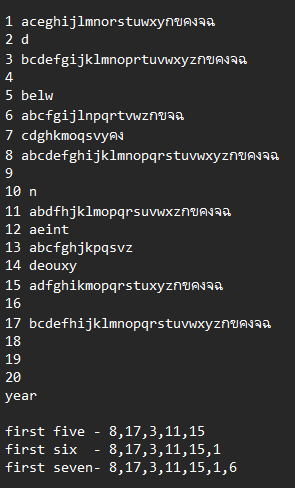
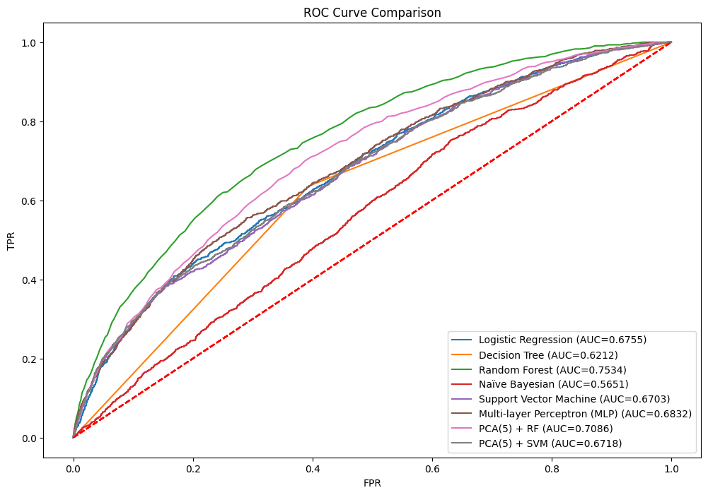
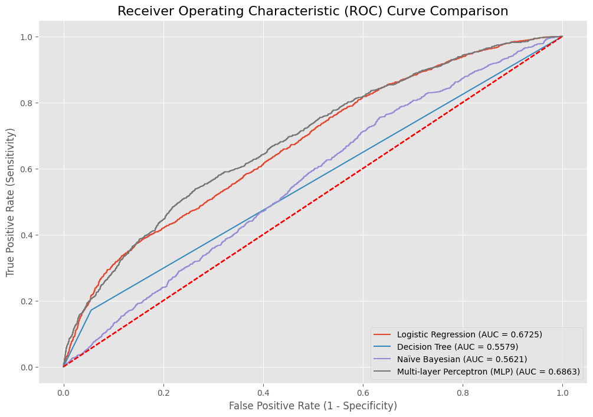
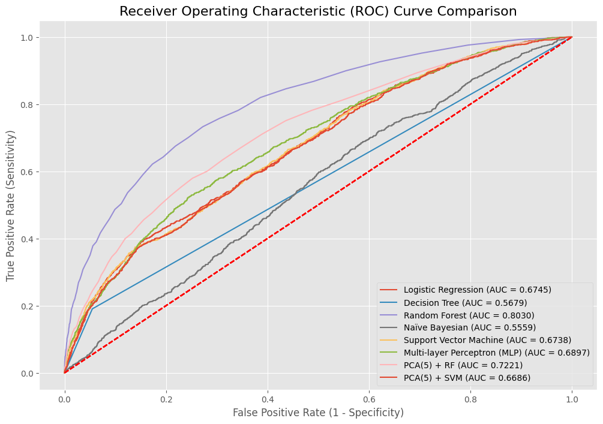

# Phase 1

ผมไม่ได้มั่นใจในความสามารถของตัวเองในด้าน AI ในตอนแรกเนื่องจากว่าผมมีเพื่อนที่เก่งกว่า, ในเริ่มต้นเลยไปศึกษา Data ด้วยการเรียนรู้ Domain Knowledge จากนั้นได้ไปรู้จักกับ Warning Sign Theory ที่เขาอธิบายถึงว่า"บริษัทนี้จะอยู่ในสถานะสุ่มเสี่ยงหากมีการขายสินทรัพย์เพื่อเอาจัวรอดเรื่อยๆ" และใช่เพราะปกติถึงแม้บริษัทฝหญ่โตที่กำลังขาดทุนอยู๋ก็ตาม เขามักจะมีสินทรัพย์ที่มั่นคงเลยสนใจ data "current_asset" เป็นหลัก

หลังจากนั้นผมได้ลองทำดูโดยแบบ มือใหม่ก่อนเพราะก่อนหน้านี้พึ่งใช้สมองไปลงกับ สอบปฏิบัติ Microcontroller

ผลปรากฏว่าจากไฟล์ `00_bankruptcy_feature_selection.ipynb` จากการไปหาไอเดียในการทำ Feature Selection หลายๆที่เลยได้มาดังนี้
1. Random Forest (built-in Gini/MDI)
2. Gradient Boosting (built-in importance)
3. Permutation Feature Importance (model-agnostic)
4. SHAP (TreeExplainer over a tree model)
5. Logistic Regression Coefficients (after scaling)

ซึ่งผมให้มันเปรียบเทียบ Comparisonกันเอง 31 ความเป็นไปได้แล้วมานั่งจด ว่าพบอันไหนบ่อยสุดซึ่งได้ดังนี้

  
  1.1 ภาพแสดงวิธีการหา feature ที่ดีที่สุด

จากนั้นช่วงหลังจากไฟล์ `00_bankruptcy_feature_selection.ipynb` ผมได้ทำไปเยอะมากแต่ไม่ได้บันทึกไว้เพราะมันไม่เวิร์ค

จนผมได้เปลี่ยนใหม่โดยไปทำเป็น Class OOP แล้วได้มาเป็นไฟล์ `01_OOP_ML_Model_Controller_for_Bankruptcy_Prediction.ipynb` แต่ท้ายสุดก็เจอกับสิ่งที่ผมได้เจอครั้งแรก

    🚀 Starting Model Training and Evaluation for all models...
    ============================================================
    Data split: Train=(62945, 7), Test=(15737, 7)

    --- Running Logistic Regression ---
    ✅ LogisticRegressionModel trained.

    --- Running Decision Tree ---
    ✅ DecisionTreeModel trained.

    --- Running Random Forest ---
    ✅ RandomForestModel trained.

    --- Running Naïve Bayesian ---
    ✅ NaiveBayesModel trained.

    --- Running Support Vector Machine ---
    ✅ SupportVectorMachineModel trained.

    --- Running Perceptron (SLP) ---
    ✅ PerceptronModel trained.

    --- Running Multi-layer Perceptron (MLP) ---
    ✅ MLPModel trained.
    ...
    --- Running K-Means Clustering (k=2) ---
    ✅ KMeanClustering trained.

    --- Running Agglomerative Clustering (k=2) ---
    Output is truncated. View as a scrollable element or open in a text editor. Adjust cell output settings...

  1.2 ข้อมูลแสดงผลลัพธ์จากการรัน ไฟล์ 01_OOP_ML_Model_Controller_for_Bankruptcy_Prediction

ใช่มันรันแล้วแตกเพราะ RAM เกินอะไรสักอย่างผมไม่ได้แคปภาพไว้เลย

# Phase 2

ขอบอกก่อนว่าก่อนผมจะทำอะไรต่อผมได้แก้ไขข้อมูลแล้วลองรัน `02_feature_selection_400n_7hrs.ipynb` Parallel กับการทำส่วนอื่นต่อ

recheck ตัวเองใหม่ด้วยการนั่งคิดว่าทำยังไงให้รอด ซึ่งอย่างน้อยผมอยากให้งานมันรอดเลยแยกรันเป็น cells แบบไฟล์ `03_Bankruptcy_PerModel_Balanced_Threshold` ผลปรากฎว่าสามารถทำงานได้แล้ว จากนั้นได้ทำใหม่และแก้ไขใหม่เรื่อยๆ

  
  1.3 ข้อมูลแสดงผลลัพธ์จากการรัน ไฟล์ 03_Bankruptcy_PerModel_Balanced_Threshold.ipynb

  
  1.4 ข้อมูลแสดงผลลัพธ์จากการรัน ไฟล์ 04_Bankruptcy_RunEachModel_Separate_Cells_2.ipynb

  
  1.5 ข้อมูลแสดงผลลัพธ์จากการรัน ไฟล์ 06_Bankruptcy_RunEachModel_Separate_Cells_08_43.ipynb

เห็นได้ชัดเลยว่า ทุกโมเดลไม่มีความแม่นยำเลย ออกไปทางเดาสุ่มเลยต้องกลับมานั่งคิดใหม่

และแล้ว `02_feature_selection_400n_7hrs.ipynb` ก็รันเสร็จได้ผลลัพธ์ดังนี้

<table border="1" class="dataframe">
  <thead>
    <tr style="text-align: right;">
      <th></th>
      <th>feature</th>
      <th>perm</th>
      <th>shap</th>
      <th>logit</th>
      <th>perm_rank</th>
      <th>shap_rank</th>
      <th>logit_rank</th>
      <th>avg_rank</th>
    </tr>
  </thead>
  <tbody>
    <tr>
      <th>8</th>
      <td>X17</td>
      <td>0.002740</td>
      <td>0.027142</td>
      <td>0.921027</td>
      <td>1.0</td>
      <td>5.0</td>
      <td>3.0</td>
      <td>3.000000</td>
    </tr>
    <tr>
      <th>11</th>
      <td>X3</td>
      <td>0.002572</td>
      <td>0.029251</td>
      <td>0.825860</td>
      <td>2.5</td>
      <td>3.0</td>
      <td>4.0</td>
      <td>3.166667</td>
    </tr>
    <tr>
      <th>16</th>
      <td>X8</td>
      <td>0.002013</td>
      <td>0.031458</td>
      <td>2.649358</td>
      <td>15.0</td>
      <td>2.0</td>
      <td>1.0</td>
      <td>6.000000</td>
    </tr>
    <tr>
      <th>0</th>
      <td>X1</td>
      <td>0.002094</td>
      <td>0.026350</td>
      <td>1.648422</td>
      <td>14.0</td>
      <td>6.0</td>
      <td>2.0</td>
      <td>7.333333</td>
    </tr>
    <tr>
      <th>14</th>
      <td>X6</td>
      <td>0.002211</td>
      <td>0.027696</td>
      <td>0.213135</td>
      <td>8.0</td>
      <td>4.0</td>
      <td>12.0</td>
      <td>8.000000</td>
    </tr>
    <tr>
      <th>1</th>
      <td>X10</td>
      <td>0.002216</td>
      <td>0.024302</td>
      <td>0.354258</td>
      <td>7.0</td>
      <td>10.0</td>
      <td>9.0</td>
      <td>8.666667</td>
    </tr>
    <tr>
      <th>2</th>
      <td>X11</td>
      <td>0.002572</td>
      <td>0.023894</td>
      <td>0.171895</td>
      <td>2.5</td>
      <td>11.0</td>
      <td>13.0</td>
      <td>8.833333</td>
    </tr>
    <tr>
      <th>5</th>
      <td>X14</td>
      <td>0.002161</td>
      <td>0.022486</td>
      <td>0.774304</td>
      <td>10.0</td>
      <td>13.0</td>
      <td>5.0</td>
      <td>9.333333</td>
    </tr>
  </tbody>
</table>

